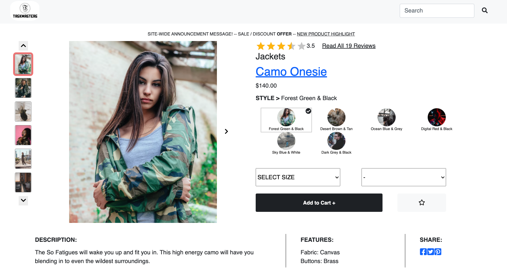
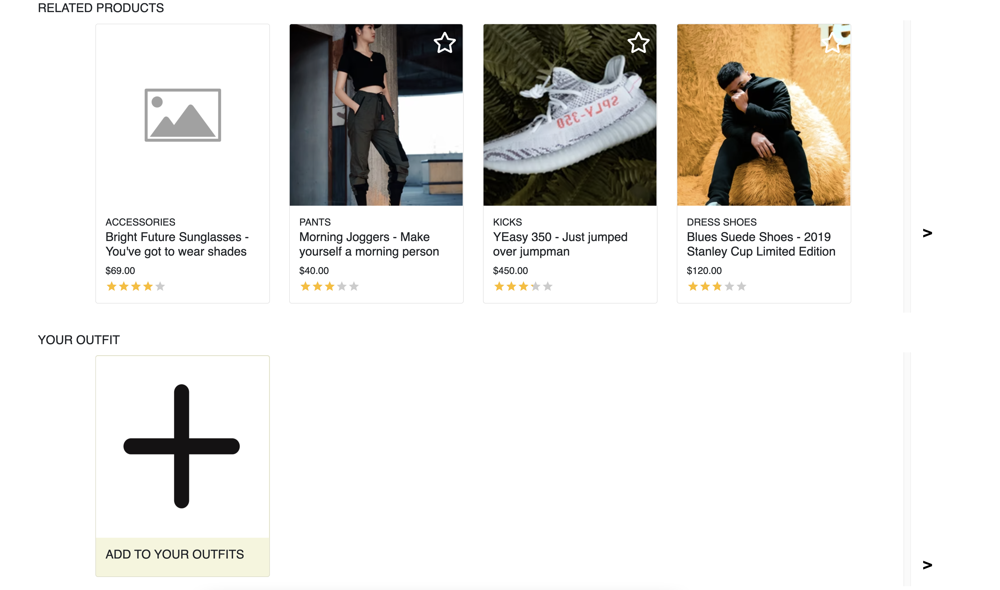
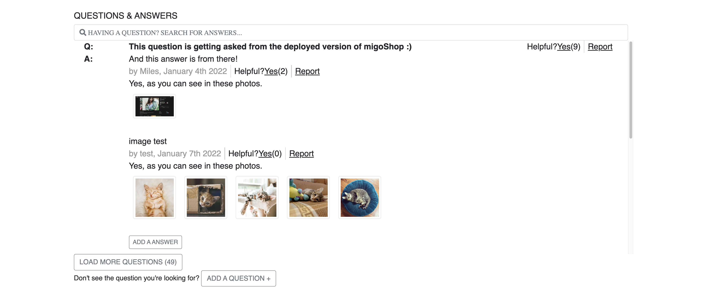
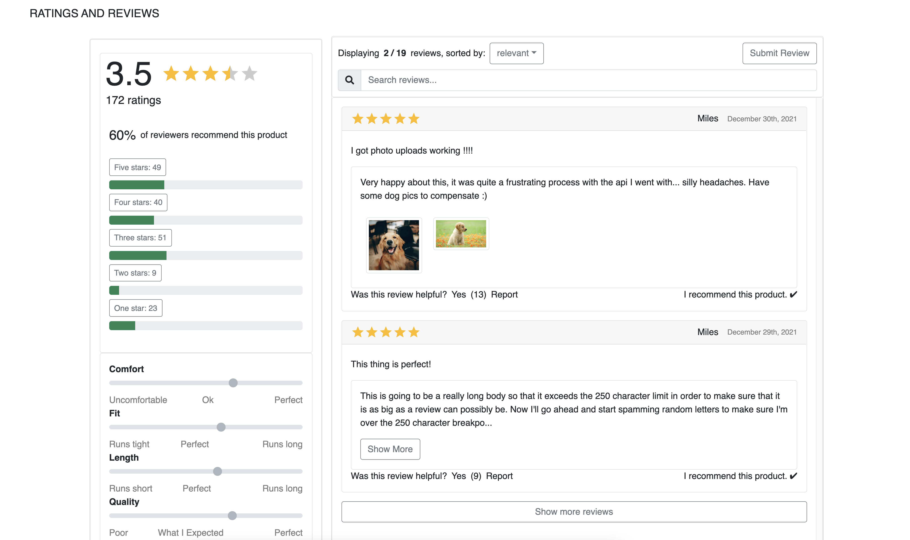

# Front-End-Capstone

## Overview

Front End Capstone Project at Hack Reactor.

## Description

The initial release focuses on providing the minimum viable product for our retail application. Features implemented is constrained to the client experience which enables customers to search, browse, add to cart, and checkout.

The product detail page shows relevant information for a single product in the catalogue. Our catalogue is organized by products. One single product can be associated to many sizes and styles which each result in unique SKUs (stock keeping units). The product detail page presents items at the product level.  Further breakdown by style or size is only reflected within the product detail page.

The same product detail page is shown for every product in the catalogue. Upon navigating to the product detail page or selecting a new product to display, the contents of the page will update to show information relevant to the selected product.

The item detail page is comprised of distinct modules. Each module displays information related to the product being displayed:

  - Product Detail
  - Ratings & Reviews
  - Questions & Answers
  - Related Items & Outfit Creation

## Component Details
### Main Product Overview

The Overview module is the top-most module on the Product Detail page. The functionality contained within this module can be divided into several pieces:
  - Image gallery
  - Product information
  - Style selector
  - Add to cart

### Related Products

The Related Items & Comparison module displays two sets of related products. The first set is a list of products, determined internally, that are related to the product currently being viewed. The second set is a list, custom created by the user, of products which the user has grouped with the current product into an ‘outfit’. This component includes:
  - Related product cards
  - List behavior
  - Related products list
  - Your outfit list

### Questions & Answers

The Questions & Answers module allows asking and answering of questions for the product selected. The functionality contained within this module can be divided into several pieces:
  - View questions
  - Search for a question
  - Asking a question
  - Answering a question

### Ratings & Reviews

The Ratings & Reviews module allows viewing and submission of reviews for the product selected. The functionality contained within this module can be divided into several pieces:
  - Write new review
  - Reviews list
  - Sorting
  - Rating breakdown
  - Product breakdown

### Technology

* [React](https://reactjs.org/)
* [Node](https://nodejs.dev/)
* [ExpressJS](https://expressjs.com/)
* [Webpack](https://webpack.js.org/)
* [AWS]()
* [React-Bootstrap](https://react-bootstrap.github.io/)
* [Jest](https://jestjs.io/)
* [Enzyme](https://enzymejs.github.io/enzyme/)

## Team

* Weiran (Rebecca) Cheng - Product Overview
  * https://github.com/weiranc

* David Sung - Related Products
  * https://github.com/dks99455

* Cynthia Xu - Questions and Answers
  * https://github.com/cynthia2604

* Ben Pintel - Rating and Reviews
  * https://github.com/bpintel

